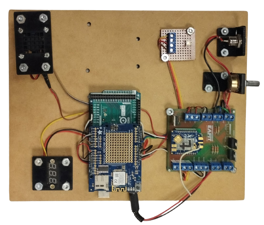

# Maqueta Smart Weather EAFIT

Docente: Davinson Castañ Cano

[Docu](https://isa242.davinsony.com/maqueta/smart-weather/)



*Figura 1: Maqueta Smart Weather EAFIT*

## Conexiones de entrada y salida

```properties
#define PIN_BATERIA   A0  // Pin voltaje de la bateria
#define PIN_DHT       9   // Pin sensor de temperatura
#define PIN_COOLER    8   // Pin ventilador
#define PIN_RED       6   // Pin led rojo
#define PIN_GREEN     3   // Pin led verde
#define PIN_BLUE      2   // Pin led azul  
```

# Ejecución

1. Instalar el simulador Wokwi [Pasos](https://isa242.davinsony.com/tutorial/simulador/).

2. Instalar Python 3 y pip (verifica que esté en tu PATH).

3. Verifica e instala pip
```bash
pip3 --version
```

Descarga el archivo get-pip.py desde este [enlace](https://bootstrap.pypa.io/get-pip.py).

Abre la terminal en la carpeta donde está el archivo descargado get-pip.py y ejecuta:
```bash
python get-pip.py
```

Vuelve a verificar con:
```bash
pip3 --version
```

4. Abrir una terminal y moverte a la carpeta python:
```bash
cd python
```

5. Instalar las dependencias necesarias:
```bash
pip install pyserial pyserial-asyncio
```

6. Ejecuta el servidor desde la terminal:

```bash
python rfc2217_server.py
```
   El servidor estará disponible en el puerto 4000.

7. Ve a master/diagram.json y ejecutalo. Deberas recibir en el socket los mensajes enviados por Serial.

8. Tambien puedes verificar si la conunicación funciona en: https://ws.davinsony.com/{jhonId}
